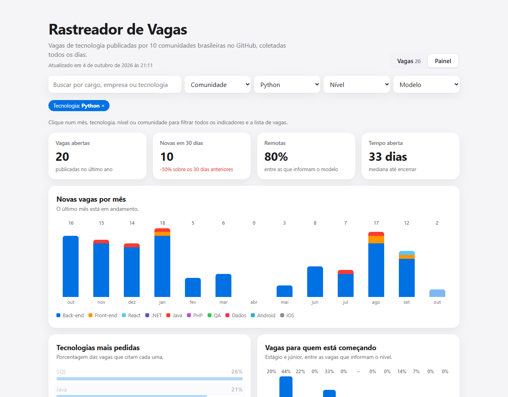

# Rastreador de Vagas

Vagas de tecnologia publicadas por 10 comunidades brasileiras no GitHub, atualizadas sozinhas todos os dias. A aba **Vagas** traz a lista com busca e filtros. A aba **Painel** mostra quantas vagas surgem por mês, as tecnologias mais pedidas, o espaço para quem está começando e o perfil das vagas (nível, modelo e regime), com filtros cruzados como no Power BI: clicar num mês, tecnologia, nível ou comunidade filtra todos os indicadores e a lista.

**Acesse:** https://gutemberg-vercosa.github.io/rastreador-vagas/

<a href="https://gutemberg-vercosa.github.io/rastreador-vagas/"></a>

## Como funciona

```
GitHub Actions (todo dia, 7h)
  └─ coletar.py   lê as vagas pela API do GitHub e grava em SQLite
  └─ exportar.py  consulta o banco e gera o JSON das vagas
  └─ build e publicação no GitHub Pages
```

- **Fonte:** as comunidades (backend-br, frontendbr, react-brasil, dotnetdevbr, soujava, phpdevbr, qa-brasil, datascience-br, androiddevbr e cocoaheadsbrasil) publicam vagas como issues, com etiquetas de nível, regime, modelo e tecnologia. A leitura é pela API oficial, sem raspar páginas.
- **Coleta:** o mês atual e os 12 anteriores, inteiros. Como a API guarda todo o histórico, o banco é recriado a cada execução e não precisa ser versionado. O repositório não cresce com os dados.
- **Classificação:** nível, modelo, regime e tecnologias vêm das etiquetas e, quando faltam, do título. Avisos e issues de manutenção são descartados.
- **Banco:** duas tabelas (`vagas` e `tecnologias`, uma linha por tecnologia citada), juntadas na exportação. O arquivo `vagas.db` fica disponível para download no próprio site.
- **Filtros cruzados:** os indicadores são calculados no navegador a partir das vagas. Cada gráfico aplica todos os filtros menos os próprios, como no Power BI: o item escolhido fica destacado e os outros, apagados, para comparação.
- **Interface:** TypeScript sem frameworks. Os gráficos são HTML e CSS, sem biblioteca.

## O que os dados já mostram

- A maioria das vagas é sênior ou pleno. As de estágio e júnior caíram de cerca de 20% para menos de 5% ao longo do último ano.
- Cerca de 80% das vagas recentes são remotas.
- Java, SQL e .NET lideram entre as tecnologias citadas.

## Rodando localmente

```bash
npm install
npm run dados   # coleta e exporta (Python 3.10+, só biblioteca padrão)
npm test        # testes da classificação, da exportação e dos filtros cruzados
npm run dev     # painel em modo de desenvolvimento
```

Sem `GITHUB_TOKEN`, a API do GitHub permite 60 requisições por hora, suficiente para uma coleta.
